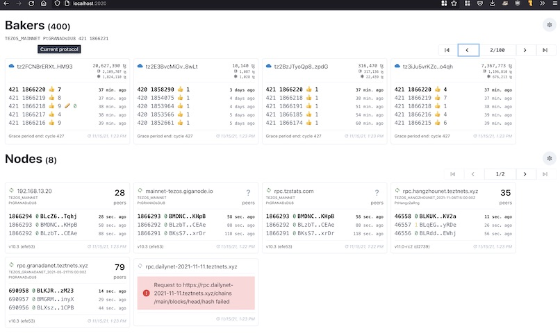
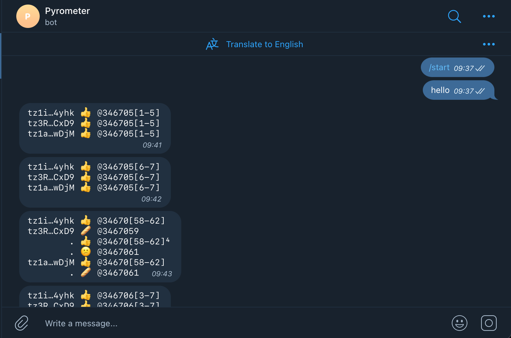
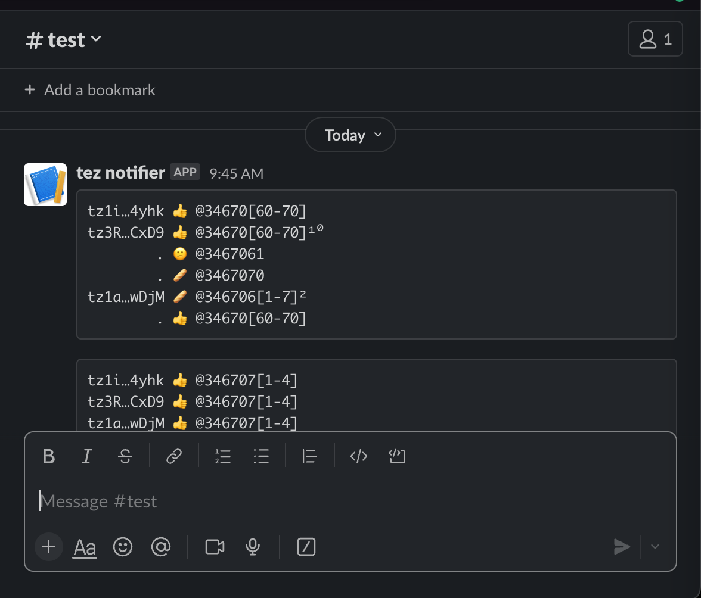

# Overview

Pyrometer is a tool for monitoring events on
[Tezos](https://tezos.com/) networks.

## Design/Architechture

- [Monitoring](./doc/monitoring.md)

## Run on Ubuntu/Debian

- Install NodeJS 16 or later following instructions at
  <https://github.com/nodesource/distributions>.

- Download latest .deb from
  <https://gitlab.com/tezos-kiln/pyrometer/-/releases>

- Install:

```shell
sudo dpkg -i pyrometer_0.8.0_all.deb
```

- If Pyrometer is installed on a machine where Tezos baker is [set up
  with tezos-packaging](https://github.com/serokell/tezos-packaging/blob/master/docs/baking.md)
  then status UI will be automatically enabled and available at
  <http://localhost:2020>, configured to monitor local node and baker.
  Otherwise edit config file `/etc/pyrometer.toml`
  to specify bakers and nodes to monitor, for example:

```shell
sudo nano /etc/pyrometer.toml
```

- If desired, edit config file `/etc/pyrometer.toml` to configure notification
  channels

- If config file was edited - restart pyrometer service:

```shell
sudo systemctl restart pyrometer
```

- Check log output, e.g.:

```shell
journalctl -u pyrometer -f
```

## Run with Docker

Lets define shell alias so that following example commands are concise
and clear:

```shell
docker network create pyrometer
alias pyrometer="docker run --network pyrometer --rm -v $PWD:$PWD registry.gitlab.com/tezos-kiln/pyrometer"
```

Lets also create a directory for pyrometer configuration and data:

```shell
mkdir -p ./pyrometer/data
cd pyrometer
```

Generate sample Pyrometer configuration and save it as `pyrometer.toml`:

```shell
pyrometer config sample > pyrometer.toml
```

> ℹ️ Pyrometer configuration file uses [TOML](https://toml.io) syntax

Edit `pyrometer.toml` as necessary.

For example, lets say we would like to monitor some of the Foundation
Bakers and receive email notifications for all the events except
successful bakes and endorsements.

For illustration purposes we will use
[MailHog](https://github.com/mailhog/MailHog) as our SMTP
server. Start MailHog:

```shell
docker run --rm --name mailhog --network pyrometer -d -p 8025:8025 mailhog/mailhog
```

MailHog's web interface should now be available at <http://localhost:8025/>

Edit `pyrometer.toml` to look like this:

```toml

exclude = [
  "baked",
  "endorsed",
]

[baker_monitor]
bakers = ["tz3RDC3Jdn4j15J7bBHZd29EUee9gVB1CxD9",
"tz3bvNMQ95vfAYtG8193ymshqjSvmxiCUuR5"]

## use special "wildcard" baker address to monitor all active bakers:
# bakers = ["*"]

max_catchup_blocks = 120
rpc = "https://mainnet.api.tez.ie/"

[log]
level = "debug"

[email]
enabled = true
host = "mailhog"
port = 1025
username = "aaa"
password = "bbb"
to = [ "me@example.org" ]
emoji = true
short_address = true

```

> MailHog accepts any username and password, they just need to be not empty

Now start Pyrometer:

```shell
pyrometer run -c $PWD/pyrometer.toml -d $PWD/data
```

All configuration parameters can be specified or overriden from the
command line. Run `pyrometer --help` to see available commands and
global options, `pyrometer <command> --help` to see command-specific
parameters. Most users will be interested in parameters for `run`:

```shell
pyrometer run --help
```

> ℹ️ Starting with Ithaca protocol, bakers are not punished for missing
> inidividual endorsements. Users may want to turn off notifications
> for missed endorsements (and missed bakes and bonus) and instead rely on
> `baker_unhealthy`/`baker_recovered` pair of
> events. `baker_unhealthy` notification is generated when baker
> misses several endorsements/bakes/bonuses in a row (5 by default), configured via
> `--baker_monitor:missed_threshold`

### Run Natively

Install NodeJS 16 or later. For Linux, follow instructions at
<https://github.com/nodesource/distributions>. For other operating
systems, download from <https://nodejs.org>. Configure NPM registry:

```shell
npm config set @tezos-kiln:registry https://gitlab.com/api/v4/packages/npm/
```

Assuming we have `./pyrometer.toml` config file and `./data`
directory, install Pyrometer:

```shell
npm install -g @tezos-kiln/pyrometer
```

Create a config file

```shell
pyrometer config sample > pyrometer.toml
```

and edit as necessary.

Start Pyrometer:

```shell
pyrometer run -c $PWD/pyrometer.toml -d $PWD/data
```

## Docker Build

To build the Docker image from scratch, install
[yarn](https://yarnpkg.com/), clone this repo and run:

```shell
githooks/pre-push
docker build -t tezos-kiln/Pyrometer .
```

### Status UI

Pyrometer provides node and baker status web user interface. It is
automatically enabled if local `baker` address alias found in local
`tezos-client` configuration (as would be the case when Pyrometer is
running on the same machine as baker [set up with
tezos-packaging](https://github.com/serokell/tezos-packaging/blob/master/docs/baking.md)),
otherwise it is disabled by default.

To enable, add or edit `ui` section in the config file:

```toml
[ui]
enabled = true
# port = 2020
# host = "0.0.0.0"
# explorer_url = "https://hangzhou.tzstats.com"
explorer_url = "https://tzstats.com"
show_system_info = true
```

By default status web page is served on port `2020` at `localhost`. Be
sure to set host to `0.0.0.0` if you wish to access UI from another
computer or if running with Docker (also don't forget to [publish
port](https://docs.docker.com/config/containers/container-networking/#published-ports)
where web UI is served).

[](doc/pyrometer-0.2.0-ui.png)

When local baker setup is detected Pyrometer UI also
displays system resources and process information. This can also be
explicitely enabled (or disabled) by setting `show_system_info` to
`true`.

If detecting local baker setup is not desired it can be turned off in
config:

```toml
[autodetect]
enabled = false
```

### Teztnets

Pyrometer provides a shortcut - `--teztnets` option - to enable
monitoring for test network nodes described at
<https://teztnets.xyz/>. For example, to run Pyrometer as a visual
status monitor for testnet nodes using Docker:

```shell
docker run -p 2020:2020 registry.gitlab.com/tezos-kiln/pyrometer \
    run --ui:enabled --ui:host 0.0.0.0 --teztnets
```

### Notification Channels

Run Pyrometer with `pyrometer run --help` to see the CLI and config
key names for the channel settings.

### Notifications Format

With the following configuration:

```
emoji = true
short_address = true
```

notification looks like this:

```
tz1a…wDjM 🥖 @346707[3-6]²
        . 👍 @346707[2-5]

^^^^^^^^^ ^^ ^^^^^^^^^^^ ^
    1     2       3      4
```

1. Baker's shortened tz address
2. Event type
3. Block level range
4. Event count in the level range (if less than then number of levels
   in the range)

With `short_address = false`:

```
tz1irJKkXS2DBWkU1NnmFQx1c1L7pbGg4yhk 👍 @346712[0-4]

```

With `emoji = false`:

```
tz1i…4yhk baked @3467146
        . endorsed @346714[5-6]
tz3R…CxD9 endorsed @346714[5-6]
tz1a…wDjM endorsed @346714[5-6]
```

### Address Aliases

Notifications and UI can be configured to display an alias instead tz address:

```toml
[alias]
tz3cqThj23Feu55KDynm7Vg81mCMpWDgzQZq = "TF baker 1"
tz1S8MNvuFEUsWgjHvi3AxibRBf388NhT1q2 = "Binance"
```

Aliases can also be configured for a specific notification channel or UI (merged
with global alias map):

```toml
[slack.alias]
tz2W3WMS17G2yJzaPtU3kLoPnNrfW91QftbL = "some baker"

[telegram.alias]
tz2W3WMS17G2yJzaPtU3kLoPnNrfW91QftbL = "sm bkr"

[ui.alias]
tz2W3WMS17G2yJzaPtU3kLoPnNrfW91QftbL = "Some Baker"
```

### Node Names

UI can be configured to display user-defined node name instead of hostname by
defining each node in `nodes` array as an [inline
table](https://toml.io/en/v1.0.0#inline-table) with `url` and `name` keys:

```toml

[node_monitor]
nodes = [{url = "https://rpc.oxfordnet.teztnets.xyz", name = "Oxfordnet"}, {url = "https://rpc.ghostnet.teztnets.xyz", name = "Ghostnet"}]

```

or defining `nodes` as array of tables like so:

```toml

[[node_monitor.nodes]]
url = "https://rpc.oxfordnet.teztnets.xyz"
name = "Oxfordnet"

[[node_monitor.nodes]]
url = "https://rpc.ghostnet.teztnets.xyz"
name = "Ghostnet"
```

### Event Types

- 🤒 baker unhealthy

  baker missed `baker_monitor:missed_threshold` events in a row

- 💪 baker recovered

  baker successfully baked or endorsed after being unhealthy

- 😡 missed bake

  baker was scheduled to produce a block at this level, but failed to
  do so

- 😾 missed baking bonus

  baker proposed a block payload, but failed to actually produce the
  block itself, another baker did that and received the bonus

- 🥖 baked

  baker produced a block as scheduled per baking rights

- ✂️️️️ double baked

  baker produced two different blocks in the same round, baker's
  deposit will be slashed as punishment

- 😕 missed endorsement

  baker missed an endosement

- ‼️️ double endorsed

  baker endorsed two different blocks in the same round

- ‼️️ double pre-endorsed

  baker pre-endorsed two different blocks in the same round

- 🐌 node behind

  a monitored node is not synchronized with the blockchain, is at a
  lower block level then the other nodes in the network

- 💫 node synced

  a monitored node has caught up with the blockchain after falling behind

- 🤔 low peers

  a monitored node has fewer than `node_monitor:low_peer_count`
  peers

- 🤝 low peers resolved

  a monitored node connected to a sufficient number of
  `node_monitor:low_peer_count` peers

- 😴 deactivated

  baker has been deactivated

- 😪 deactivation risk

  baker is at risk of deactivation (baker stopped participating and
  will be deactivated once previously calculated baking right run out)

- ⚠️ rpc error

  an error occurred while communicating with Tezos node RPC interface

#### Desktop

Shows desktop notifications (not available when running in Docker)

#### Telegram

Sends notifications via Telegram. To enable:

1. Send `/newbot` to the Telegram BotFather bot and follow the
   instructions to create a bot that Pyrometer will use to send
   notifications. If you've already made a bot, skip to the next
   step. [Start BotFather
   Conversation](https://telegram.me/BotFather).
1. After creating your bot, copy the "HTTP API Token" from the
   BotFather and provide it to Pyrometer either via the CLI or the
   user config file.
1. Click the link to your bot that the BotFather gives you and send
   `/start` to your bot.
1. Start Pyrometer within 24 hours of starting your bot to load the
   `chatId` and complete your setup. If you attempt to complete this
   after 24 hours and the chatId cannot be found, simply send another
   message to your bot and try again.



#### Email

The email notification channel uses SMTP settings that you provide to
send your notifications to an email address. See Pyrometer's help for
the settings. We recommend using
[MailCatcher](https://mailcatcher.me/) or
[MailHog](https://github.com/mailhog/MailHog) to try this out locally while
you're fine-tuning the volume of events you want to receive.

#### Slack

This channel will post your notifications to a Slack webhook. Follow
[the instructions here](https://api.slack.com/messaging/webhooks) to
configure your webhook, and provide the URL to Pyrometer.



#### Webhook

This channel will post the raw JSON of an event to a webhook. We
recommend this for creating custom apps and visualizations using
Pyrometer's data.
