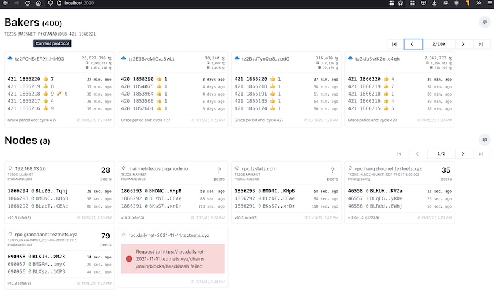

# Pyrometer

Monitoring tool for [Tezos](https://tezos.com/) bakers and nodes.

Supports Seoul (023) and Tallinn (024) protocols with Octez v24+.

## Architecture

- [Monitoring](./doc/monitoring.md)

## Install

### Docker

```shell
docker pull ghcr.io/aure64/pyrometer-test:latest
docker run ghcr.io/aure64/pyrometer-test:latest run -c /path/to/pyrometer.toml
```

### Ubuntu/Debian (.deb)

Install NodeJS 16+ following instructions at <https://github.com/nodesource/distributions>.

Download the latest `.deb` from [Releases](https://github.com/Aure64/pyrometer-test/releases), then:

```shell
sudo dpkg -i pyrometer_<version>_all.deb
```

### macOS / Generic (tarball)

Requires Node.js >= 16.

Download `pyrometer-<version>.tar.gz` from [Releases](https://github.com/Aure64/pyrometer-test/releases):

```shell
tar xzf pyrometer-<version>.tar.gz -C /usr/local/lib
ln -sf /usr/local/lib/pyrometer/pyrometer /usr/local/bin/pyrometer
```

## Quick start

Generate a minimal config file:

```shell
pyrometer config sample --minimal > /etc/pyrometer.toml
```

This produces a short config with the essential settings:

```toml
[baker_monitor]
bakers = [ "tz1YOUR_BAKER_ADDRESS" ]
rpc = "https://mainnet.api.tez.ie/"

[ui]
enabled = true
port = 2020

[log]
level = "info"
```

Replace `tz1YOUR_BAKER_ADDRESS` with your baker's address, then start:

```shell
pyrometer run -c /etc/pyrometer.toml
```

On startup, Pyrometer logs the Web UI address (default: `http://localhost:2020`). Baker addresses can also be managed from the UI Settings page.

If installed via `.deb`, use the systemd service instead:

```shell
sudo systemctl restart pyrometer
journalctl -u pyrometer -f
```

## Configuration

The config file uses TOML. To generate a full config with all available options:

```shell
pyrometer config sample
```

All options can also be passed via CLI. Run `pyrometer run --help` for details.

### Full example

```toml
exclude = [
  "baked",
  "endorsed",
]

[baker_monitor]
bakers = ["tz3RDC3Jdn4j15J7bBHZd29EUee9gVB1CxD9"]
# monitor all active bakers:
# bakers = ["*"]
max_catchup_blocks = 120
rpc = "https://mainnet.api.tez.ie/"

[log]
level = "info"

[email]
enabled = true
host = "mailhog"
port = 1025
username = "aaa"
password = "bbb"
to = [ "me@example.org" ]
emoji = true
short_address = true
```

### TzKT (optional)

Displays the baker's Octez version via the TzKT API. Disabled by default; when disabled, no requests are made to TzKT.

```toml
[tzkt]
enabled = true
# base_url = "https://api.tzkt.io"
```

### Web UI

Pyrometer includes a web interface for baker and node status. It is enabled by default on port 2020.

```toml
[ui]
enabled = true
# port = 2020
# host = "0.0.0.0"
explorer_url = "https://tzstats.com"
show_system_info = true
```

By default the UI listens on `localhost`. Set `host = "0.0.0.0"` to access it from another machine.

[](doc/pyrometer-0.2.0-ui.png)

Setting `show_system_info = true` adds system resources and process information to the UI. This is auto-detected when a local tezos-client setup is found.

### Autodetect

Pyrometer can auto-detect baker addresses and RPC endpoints from a local `tezos-client` directory (useful when running alongside a baker [set up with tezos-packaging](https://github.com/serokell/tezos-packaging/blob/master/docs/baking.md)). This is enabled by default. To disable:

```toml
[autodetect]
enabled = false
```

---

`.deb` packages, tarballs, and Docker images are on the [Releases](https://github.com/Aure64/pyrometer-test/releases) page and [GHCR](https://ghcr.io/aure64/pyrometer-test).
