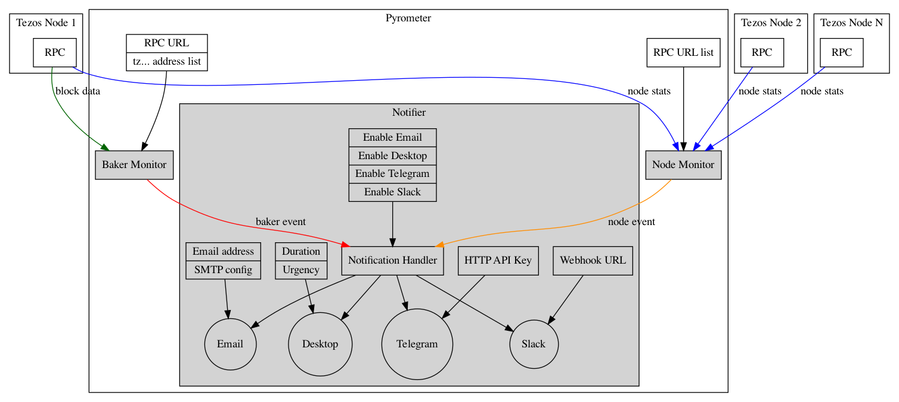

# Overview

Anyone who runs Tezos baker is interested in monitoring baker's health
to minimize lost reward opportuinities due to missed bakes and
endorsements. Bakers may miss bakes and endorsements for a number of
reasons, some are intermittent and self-correcting while others
require operators intervention. Promptly alerting baker operators of
missed bakes and endorsements, as well as other problems or potential
problems is key to minimize missed rewards.

This is especially important for hobbyist bakers that may not have
resources to solve this problem on their own.

Baker monitoring reliability depends on having access to a healthy
Tezos node that's in sync with the blockchain. To that end, it is also
necessary to be able to monitor health of Tezos nodes.

## Components

The monitoring system consists of the following main components:

- Baker Monitor (BM)
- Node Monitor (NM)
- Notifier

Baker Monitor watches blockchain data (streaming events from Tezos Node
monitoring RPC endpoint or polling last block data), detects events of
interest and passes them on to Notifier.

Node Monitor periodically checks Tezos node stats/vitals, detects outages
and posts notifications via Notifier.

Notifier generates user notifications from events posted by Node
Monitor and Baker Monitor and sends them via configured
notification channels.

Baker events of interest are:

- Missed endorsements
- Missed bakes
- Double endorsements and bakes (accusations)

for each user specified baker

Node events of interest are:

- Node can't be reached
- Node is behind
- Node is on a branch
- Low number of peers

User notification channels are:

- Email
- Desktop notifications
- Telegram
- Slack

## Functional Requirements

- Monitoring should run as a native daemon/service on the following operating
  systems:

  - Linux (systemd)
  - MacOS (launchctl)
  - Windows (service)

- Monitoring should be able to run as Docker container

- BM should be able to work with any Tezos Node that exposes
  necessary RPC/streaming endpoints, public or local

- BM should be able to catch up to the blockchain after
  restart/downtime, detecting all events of interest and sending all
  corresponding notifications

- Notification delivery should be retried on every channel until
  successfully sent or expired (notification should not be lost due to
  service restart, machine restart or intermittent/short network
  connectivity loss)

- BM should ignore stale events: do not register
  events older than configured amount of time or number of blocks

- Notifier should discard expired notifications  (those that could not be delivered
  within configured amount of time of number of blocks)

## Implementation Considerations

Primary installation target for initial monitoring implementation is a
personal computer. Consequently, implementation should prioritize
simplicity when it comes to number of individual, isolated components,
processes, their runtime dependencies,
administration/configuration. For example, an embedded database such
as sqlite or file would be preferable to a full RDBMS such as
Postgres, embedded queue or job manager would be preferable to a full
message broker such as RabbitMQ etc.
